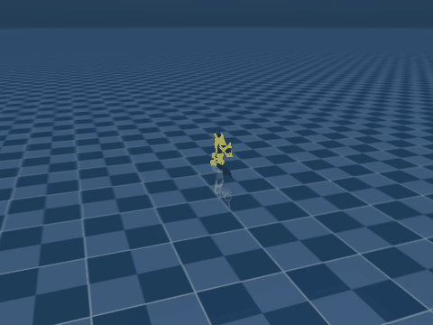
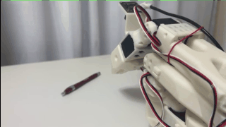
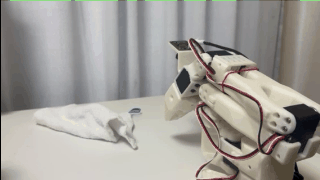

# FuRoC-SO-ARM101-LeRobot

> Based on [SO-ARM101-LeRobot](https://github.com/horndeer/SO-ARM101-LeRobot) by TheRobotStudio & Hugging Face.
> Licensed under the [Apache License 2.0](LICENSE).

No-hardware simulation learning pipeline for SO-101 robot arm: MuJoCo simulation + LeRobot + remote GPU training.

[Architecture Overview](docs/architecture_overview.html) | [Pipeline Guide](docs/no_hardware_deployment.md) | [Training Logs](docs/training_logs/)

---

## Pipeline

| Phase | Status | Description |
|:-----:|:------:|:------------|
| 0 | Done | Environment setup (local venv + RTX 6000D + HF Hub) |
| 1 | Done | PushT simulation training (CPU, validation) |
| 2 | Done | SO-101 MuJoCo data collection (10 eps, 800 frames) |
| 3 | Done | ACT training on RTX 6000D (52M params, 10K steps, checkpoint saved) |
| 4 | Done | SmolVLA exploration (450M, model loaded, not mainstream for SO-101) |

## Results

### ACT Policy Evaluation (SO-101 MuJoCo Simulation)

<p align="center">
  
  
</p>

<p align="center"><em>Left: ACT checkpoint (10K steps) evaluated for 100 steps &nbsp;|&nbsp; Right: Quick 10-step eval</em></p>

### PushT Diffusion Policy

<p align="center">
  
</p>

### Community ACT Reference Demos

<p align="center">
  
  
</p>

<p align="center"><em>Community ACT models for SO-101 (pick pen / pick rag tasks)</em></p>

## Architecture

```
Hardware Layer          Simulation Layer          Training Layer          Documentation
─────────────          ─────────────────          ──────────────          ─────────────
STL/ STEP/             sim_viewer.py              Local CPU:              docs/
Optional/              render_test.py             PushT (validation)      no_hardware_deployment.md
Simulation/SO101/      collect_sim_data.py ★      SmolVLA (loading)       GPU_Train_Command_Reference.md
URDF + MJCF            convert_to_lerobot_dataset  Remote RTX 6000D:      RTX_Server_Guide.md
                       ─────────────────────       ACT (52M) ★            Sim2Sim_Guide.md
                       MuJoCo offscreen render     SmolVLA (450M)         training_logs/
                       → LeRobot native format     batch=64, workers=4    so101_references/
```

## Data Flow

```
MuJoCo scene.xml → collect_sim_data.py → LeRobotDataset → HF Hub → RTX 6000D → ACT Policy → Eval
                   (offscreen render)    (images+meta)    (sync)   (lerobot-train)  (MuJoCo)
```

## Tech Stack

| Component | Version | Role |
|-----------|---------|------|
| MuJoCo | 3.8.0 | Physics simulation + offscreen rendering |
| LeRobot | 0.5.1 | Dataset management + training framework |
| PyTorch | 2.x | Model training (CPU local / CUDA remote) |
| ACT | 52M params | Mainstream SO-101 policy (30+ models on HF) |
| SmolVLA | 450M (99.9M trainable) | Vision-Language-Action exploration |
| RTX 6000D | 8x 85GB | Remote GPU training server |

## Policy Comparison

| Policy | Params | SO-101 HF Models | Status |
|--------|--------|-------------------|--------|
| **ACT** | 52M | 30+ | Done (Phase 3) |
| Diffusion Policy | ~30M | — | Validated (Phase 1) |
| SmolVLA | 450M | 4-5 | Explored (Phase 4) |

## Quick Start

```bash
# 1. Setup
python -m venv .venv && .venv/Scripts/activate
pip install lerobot mujoco

# 2. Collect simulation data
python collect_sim_data.py

# 3. Train on remote GPU
ssh phh@192.168.120.155  # RTX 6000D
lerobot-train --dataset.repo_id=<your_dataset> --policy.type=act --policy.device=cuda:0
```

Full walkthrough: [docs/no_hardware_deployment.md](docs/no_hardware_deployment.md)

## Project Structure

```
FuRoC-SO-ARM101-LeRobot/
├── collect_sim_data.py              # Core data collection (MuJoCo → LeRobot)
├── render_test.py                   # Offscreen render verification
├── convert_to_lerobot_dataset.py    # Format conversion
├── sim_viewer.py                    # MuJoCo interactive viewer
├── eval_pusht.py                    # PushT policy evaluation
├── eval_rollout.py                  # ACT rollout evaluation
├── run_collect.py                   # Data collection launcher
├── run_pipeline_rtx.sh              # RTX training pipeline script
├── orchestrator_arm101/             # Automated training orchestrator
├── training_plans/                  # Training plan YAML configs
├── Simulation/SO101/                # MuJoCo scene + URDF/MJCF
├── docs/
│   ├── no_hardware_deployment.md    # 5-phase pipeline guide
│   ├── architecture_overview.html   # Full architecture document
│   ├── so101_references/            # HF model survey + demos
│   └── training_logs/               # Session-by-session logs
└── README.md
```
