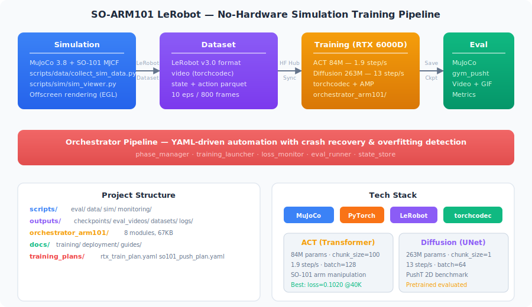
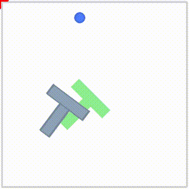

# FuRoC-SO-ARM101-LeRobot

> Based on [SO-ARM101-LeRobot](https://github.com/horndeer/SO-ARM101-LeRobot) by TheRobotStudio & Hugging Face.
> Licensed under the [Apache License 2.0](LICENSE).

No-hardware simulation learning pipeline for SO-101 robot arm: MuJoCo simulation + LeRobot + remote GPU training.

[Orchestrator Architecture](docs/github_readme/orchestrator_architecture.md) | [Pipeline Guide](docs/guides/no_hardware_deployment.md) | [Training Logs](docs/training/training_logs/)

---

## Architecture

<p align="center">
  
</p>

## Pipeline

| Phase | Status | Description |
|:-----:|:------:|:------------|
| 0 | Done | Environment setup (local venv + RTX 6000D + HF Hub) |
| 1 | Done | PushT simulation training (CPU, validation) |
| 2 | Done | SO-101 MuJoCo data collection (10 eps, 800 frames) |
| 3 | **Active** | **ACT training on RTX 6000D (84M params, 50K steps, torchcodec + AMP)** |
| 4 | Done | PushT Diffusion evaluation on RTX 6000D |

## Results

### ACT Policy — Best Checkpoint (step 40K, loss 0.1020)

<p align="center">
  
  
</p>

<p align="center"><em>Left: Best checkpoint (step 40K) &nbsp;|&nbsp; Right: Early checkpoint (step 10K)</em></p>

### PushT Diffusion Policy Evaluation

<p align="center">
  
  
</p>

<p align="center"><em>Diffusion policy pushing T-block to target (5 episodes, reward: 46.2 / 30.4 / 0.0 / 0.6 / 0.0)</em></p>

### Community ACT Reference Demos

<p align="center">
  
  
</p>

<p align="center"><em>Community ACT models for SO-101 (pick pen / pick rag tasks)</em></p>

## Data Flow

```
MuJoCo scene.xml → collect_sim_data.py → LeRobotDataset → HF Hub → RTX 6000D → ACT Policy → Eval
                   (offscreen render)    (images+meta)    (sync)   (lerobot-train)  (MuJoCo)
```

## Tech Stack

| Component | Version | Role |
|-----------|---------|------|
| MuJoCo | 3.8.0 | Physics simulation + offscreen rendering |
| LeRobot | 0.5.1 | Dataset management + training framework |
| PyTorch | 2.x | Model training (CPU local / CUDA remote) |
| ACT | 84M params | SO-101 manipulation policy (chunk_size=100) |
| Diffusion | 263M params | PushT benchmark policy |
| torchcodec | latest | Video decoding (8-20x faster than pyav) |
| RTX 6000D | 8x 85GB | Remote GPU training server |

## Policy Comparison

| Policy | Params | Speed (RTX 6000D) | Best Loss | Status |
|--------|--------|-------------------|-----------|--------|
| **ACT** | 84M | 1.9 step/s (torchcodec+AMP) | 0.1020 @step 40K | Training (→50K) |
| **Diffusion** | 263M | 13 step/s (torchcodec) | — | Evaluated (pretrained) |

> Speed benchmark & optimization details: [docs/github_readme/README.md](docs/github_readme/README.md)

## Quick Start

```bash
# 1. Setup
python -m venv .venv && .venv/Scripts/activate
pip install lerobot mujoco

# 2. Collect simulation data
python scripts/data/collect_sim_data.py

# 3. Train on remote GPU (with optimal config)
# See docs/guides/GPU_Train_Command_Reference.md for full benchmark & bug workarounds
export CUDA_VISIBLE_DEVICES=6
export LD_PRELOAD=~/miniconda3/envs/lerobot/lib/libstdc++.so.6
export HF_ENDPOINT=https://hf-mirror.com
```

Full walkthrough: [docs/guides/no_hardware_deployment.md](docs/guides/no_hardware_deployment.md)

## Automated Pipeline (Orchestrator)

YAML-driven automated training pipeline with crash recovery and overfitting detection.

```
┌──────────────┐     ┌──────────────┐     ┌──────────────┐     ┌──────────────┐
│  Collection   │ ──► │   Training   │ ──► │  Evaluation  │ ──► │  Comparison  │
│ DataCollector │     │ TrainLauncher│     │  EvalRunner  │     │ (optional)   │
│ + LossMonitor │     │ + LossMonitor│     │  + metrics   │     │              │
└──────────────┘     └──────────────┘     └──────────────┘     └──────────────┘
       ▲                    ▲                    ▲
       │                    │                    │
  ┌────┴────────────────────┴────────────────────┴────┐
  │            Arm101Orchestrator (main loop)          │
  │  phase_manager ─ state_store ─ crash recovery      │
  └───────────────────────────────────────────────────┘
```

```bash
# Full pipeline (collection → training → evaluation)
python -m orchestrator_arm101.arm101_orchestrator \
    --plan training_plans/so101_push_plan.yaml --device cuda:7 --fresh

# Dry run (preview plan)
python -m orchestrator_arm101.arm101_orchestrator \
    --plan training_plans/so101_push_plan.yaml --dry-run

# Resume from specific phase
python -m orchestrator_arm101.arm101_orchestrator \
    --plan training_plans/rtx_train_plan.yaml --start-from train_act --device cuda:6
```

**Features:** Three-layer config merging, overfitting detection (loss plateau + increase), auto-retry (2x), atomic state persistence, PID-based crash recovery.

Full architecture docs: [docs/github_readme/orchestrator_architecture.md](docs/github_readme/orchestrator_architecture.md)

## Project Structure

```
FuRoC-SO-ARM101-LeRobot/
├── scripts/
│   ├── eval/                          # Evaluation scripts
│   ├── data/                          # Data collection & conversion
│   ├── sim/                           # MuJoCo viewer & render test
│   └── monitoring/                    # Standalone loss monitor
├── orchestrator_arm101/               # Automated training orchestrator
├── training_plans/                    # YAML training configs
├── outputs/
│   ├── checkpoints/                   # Training checkpoints
│   │   ├── act_v7_040000/             # ACT best (loss 0.1020)
│   │   ├── so101_act/                 # ACT early test (step 10K)
│   │   └── pusht_diffusion/           # PushT diffusion
│   ├── eval_videos/                   # Evaluation videos + GIFs
│   ├── datasets/                      # Local LeRobot datasets
│   └── logs/                          # Training logs
├── docs/
│   ├── training/                      # Training versions & session logs
│   ├── deployment/                    # RTX server, cloud GPU, multi-GPU
│   ├── guides/                        # Pipeline, sim2sim, command reference
│   └── github_readme/                 # README assets (SVG, architecture doc)
├── run_pipeline_rtx.sh                # RTX training pipeline script
└── README.md
```
