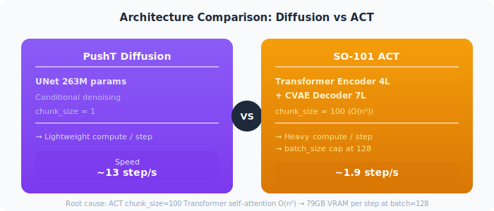
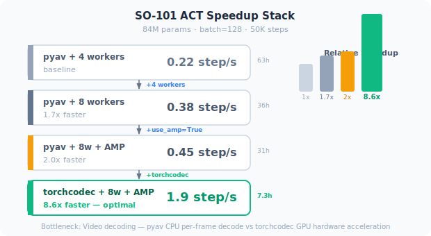
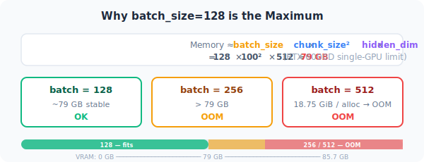

# SO-101 Training Framework & Reference Models

HuggingFace SO-101 模型调研 + 本项目训练框架效率对比。

---

## Training Framework Overview

本项目在 RTX 6000D 上同时训练两种 Policy：

| | PushT Diffusion | SO-101 ACT |
|---|---|---|
| **Policy** | Diffusion (UNet) | ACT (Transformer) |
| **Params** | 263M | 84M |
| **Dataset** | `lerobot/pusht` (26K frames, 206 eps) | `PhangHongHao/so101_push_sim` (30K frames, 300 eps) |
| **Task** | 2D Push-T (验证) | SO-101 机械臂推物 (实际任务) |
| **batch_size** | 64 | 128 |
| **steps** | 100K | 50K |
| **Device** | cuda:7 | cuda:6 |

### Architecture Difference



**ACT 慢的根本原因：** `chunk_size=100` 的 Transformer decoder 自注意力复杂度 O(n^2)，128 batch 时单 step 显存占用 ~79GB（RTX 6000D 单卡上限），无法进一步增大 batch。

---

## Speed Benchmark: pyav vs torchcodec

### PushT Diffusion (263M params, batch=64)

| Metric | pyav | torchcodec | 加速比 |
|--------|------|------------|--------|
| **Speed** | 0.5-0.7 step/s | 12-15 step/s | **~20x** |
| **100K steps ETA** | ~40h | ~2h | |
| **Loss** | — | 0.022-0.024 | |

### SO-101 ACT (84M params, batch=128)

| Config | Speed | 50K steps ETA | 备注 |
|--------|-------|---------------|------|
| pyav, 4 workers | 0.22 step/s | ~63h | 最初配置 |
| pyav, 8 workers | 0.38 step/s | ~36h | 增大 workers |
| pyav, 8 workers, AMP | 0.45 step/s | ~31h | 开启混合精度 |
| **torchcodec, 8 workers, AMP** | **1.9 step/s** | **~7.3h** | **最优配置 (8.6x)** |

### Speedup Stack



**瓶颈分析：** GPU 利用率始终 100%，但 `data_s`（数据加载时间）在 pyav 下远高于 torchcodec。视频解码是真正的瓶颈 — pyav 用 CPU 逐帧解码，torchcodec 用 GPU 硬件加速。

---

## Optimal Training Configuration

### Required Environment Variables

```bash
# torchcodec 依赖: conda libstdc++ 提供 CXXABI_1.3.15
export LD_PRELOAD=~/miniconda3/envs/lerobot/lib/libstdc++.so.6
# LeRobot v0.5.1 bug: is_amp_available("cuda:N") 会 crash，必须用 CUDA_VISIBLE_DEVICES + plain cuda
export CUDA_VISIBLE_DEVICES=6
# HF 镜像
export HF_ENDPOINT=https://hf-mirror.com
```

### Launch Command (SO-101 ACT)

```bash
python -u -c "
import sys
sys.argv = [
    'lerobot-train',
    '--dataset.repo_id=PhangHongHao/so101_push_sim',
    '--dataset.root=/tmp/so101_push_sim_lerobot',
    '--dataset.video_backend=torchcodec',     # 关键: 8.6x 加速
    '--policy.type=act',
    '--policy.device=cuda',                   # 不写 cuda:N！
    '--policy.repo_id=PhangHongHao/so101_push_sim_act',
    '--policy.chunk_size=100',
    '--policy.n_obs_steps=1',
    '--policy.dim_model=512',
    '--policy.n_heads=8',
    '--policy.n_encoder_layers=4',
    '--policy.n_decoder_layers=7',
    '--policy.use_vae=True',
    '--policy.use_amp=True',                  # ~1.2x 加速
    '--batch_size=128',                       # 最大值, 512 OOM
    '--steps=50000',
    '--save_freq=5000',
    '--num_workers=8',
]
from lerobot.scripts.lerobot_train import main
main()
"
```

### Known Bugs & Workarounds

| Bug | Root Cause | Fix |
|-----|-----------|-----|
| `is_amp_available("cuda:6")` ValueError | LeRobot v0.5.1 只接受 "cuda"/"cpu"/"xpu"/"mps" | `CUDA_VISIBLE_DEVICES=6` + `--policy.device=cuda` |
| torchcodec `DecodingError` | `is_amp_available` crash 被 torchcodec 捕获 | 同上 |
| `CXXABI_1.3.15 not found` | torchcodec 的 openvino 依赖需要新版 libstdc++ | `LD_PRELOAD=~/miniconda3/envs/lerobot/lib/libstdc++.so.6` |
| `libavutil.so.X not found` | torchcodec 需要 FFmpeg | `conda install -c conda-forge ffmpeg` |
| batch_size=512 OOM | ACT chunk_size=100 O(n^2) 显存，128 batch ≈ 79GB | 使用 batch_size=128 |

### Why batch_size=128 is the Maximum



---

## Reference Models (HuggingFace Survey)

扫描 HF 上 100+ 个 SO-101 模型后的精选参考。

### Notable Models

| # | Model | Policy | Downloads | Key Info |
|---|-------|--------|-----------|----------|
| 1 | `Sa74ll/smolvla_so101_pickandplace` | SmolVLA | 393 | 87.66% 成功率，数据分割策略 |
| 2 | `TakuyaHiraoka/act_so101_pick_diverse_objects` | ACT | 390 | 有演示视频，真实机械臂 |
| 3 | `AdityaRege/so101-pick-place-act` | ACT | 121 | HF 最多点赞 (3) |
| 4 | `edge-inference/smolvla-so101-pick-orange` | SmolVLA | 126 | Isaac Sim，详细架构描述 |
| 5 | `davidlinjiahao/lerobot_so101_base_sim_pickplace` | ACT | 1 | MuJoCo 仿真，66.7% @ 50K，与本项目最相似 |
| 6 | `Vizuara/dreamzero-so101-lora` | World Action | 66 | 同时预测动作 + 未来视频帧 |

### Demo Videos (from TakuyaHiraoka)

> 第三方模型演示视频，非本项目训练结果。

`videos/act_so101_pick_rag.gif` — 抓抹布:


`videos/act_so101_pick_pen.gif` — 抓笔:


Source: https://huggingface.co/TakuyaHiraoka/act_so101_pick_diverse_objects

### Key Takeaways

1. **ACT 是 SO-101 主流策略**: HF 上 30+ 个 ACT 模型，SmolVLA 约 4-5 个
2. **SmolVLA 成功率更高但数据需求不同**: Sa74ll 达 87.66%，靠数据分割而非调参
3. **本项目 pipeline 与 davidlinjiahao 最相似**: 都是 MuJoCo 仿真 + ACT + SO-101
4. **视频解码是训练瓶颈**: torchcodec 比 pyav 快 8-20x，是 RTX 6000D 上最关键的优化
